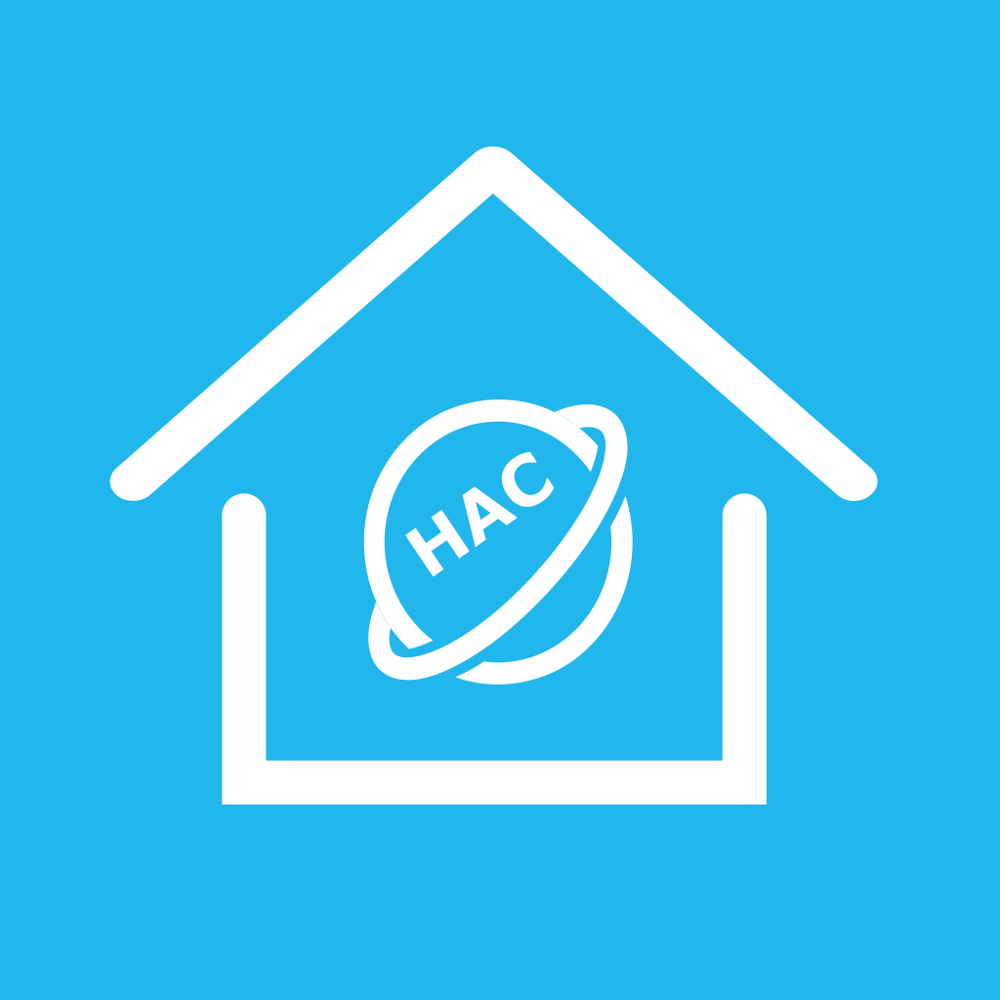

我们赞赏Home Assistant的很多理念，同时也积极使用其作为家庭自动化控制中心，不过遗憾的是即使是自称ITer的我们依然感觉Home Assistant作为一款大众产品来说在使用上依然差强人意，更遑论汉语用户（大多数社区资源集中在英语区，官方文档均为英文）。

我们希望有一个可以不断发展的社区去推动Home Assistant的易用化发展和针对汉语用户的本地化工作。虽然有很多中文社区在做着这样的工作，但是基本都依赖于爱好者的热情，在"用爱发电"。

我们希望更加组织化的开始这项工作。

HAC社区（Home Assistant in China Community）是为了实现这个目标的的努力。

作为一个有组织的社区，我们应该有属于自己的Logo，它长这样：

我们欢迎你通过我们的官方交流渠道关注我们，向我们提出你的建议，也欢迎志同道合的同志加入我们。

- [***Telegram频道***](https://t.me/hihac)
- [***电报群***](https://t.me/hihass)
- [***QQ交流群:45218782***](https://qm.qq.com/cgi-bin/qm/qr?k=KsP5QPFeIwc4DS18UL5MCv1Mn63b1sC6&jump_from=webapi)
